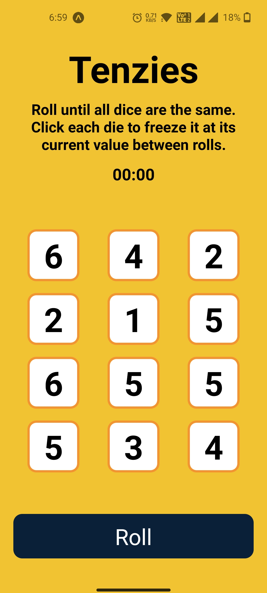
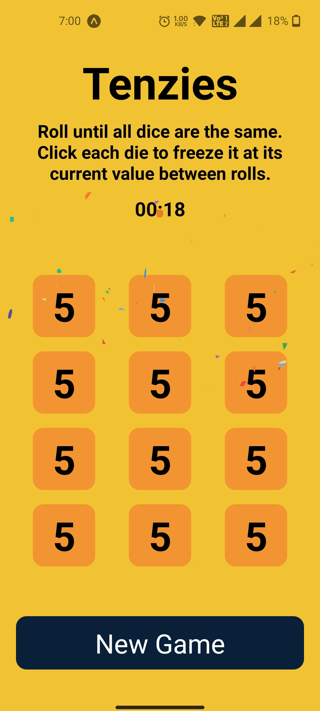

<p align="center">
    <h1 align="center">⭐ Tenzies ⭐</h1>
</p>

<p align="center">Roll and roll as fast as you can until you gets all the dice on the same number.</p>
<p align="center">Try it out on your <a href="https://yahyabagia.github.io/tenzies-expo/" target="_blank">browser 🌐 </a> &nbsp;/&nbsp;<a href="https://expo.dev/@yahyabagia/tenzies-expo" target="_blank">mobile device 📱</a>.</p>

<p align="center">
  
</p>


## Supported Platforms

| OS | Status |
| -- | -- |
| Android | Works via [Expo Go](https://docs.expo.dev/get-started/installation/#2-expo-go-app-for-ios-and) |
| iOS | Works via [Expo Go](https://docs.expo.dev/get-started/installation/#2-expo-go-app-for-ios-and) |
| Web | Works on the Browser (last 2 versions) |
 

## Environment setup
Follow the steps of the official [Expo documentation](https://docs.expo.dev/) to setup your development environment.

Quick steps:

- Install [NodeJS](https://nodejs.org/en/)
- Install [expo-cli](https://docs.expo.dev/workflow/expo-cli/) (`npm install -g expo-cli`)


## To run the app

### Clone the Repo:
```bash
git clone https://github.com/YahyaBagia/tenzies-expo.git
```

### Install the Packages:
```bash
yarn
```

### Run on Android:
```bash
yarn android
```

### Run on iOS:
```bash
yarn ios
```

### Run on Web:
```bash
yarn web
```