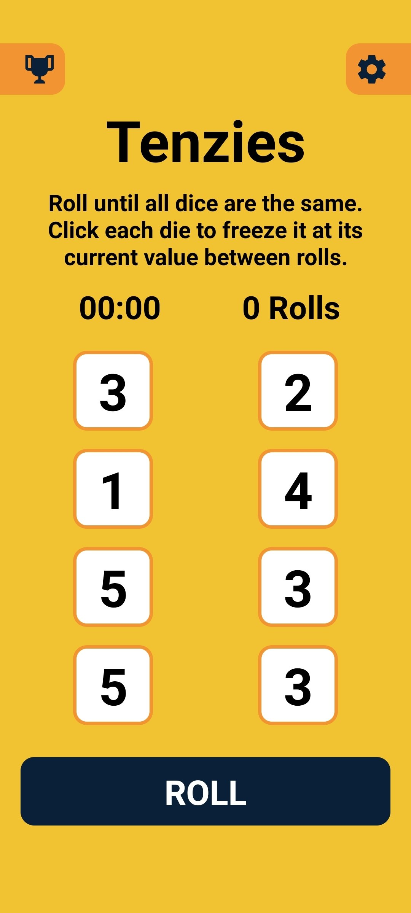
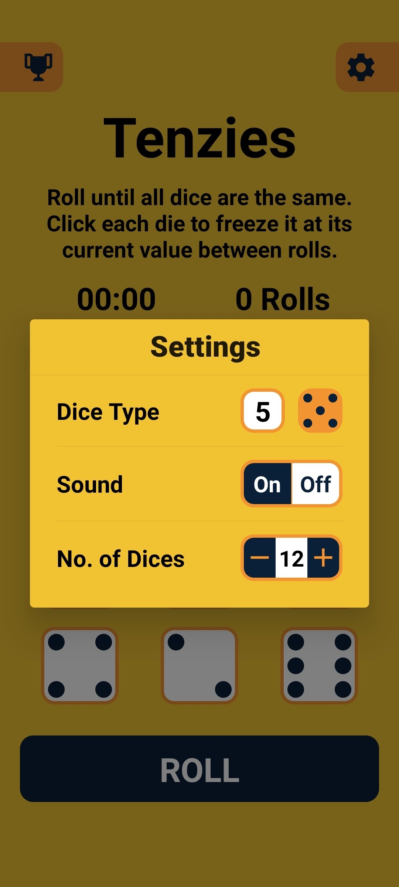

# Tenzies

Roll and roll as fast as you can until you gets all the dice on the same number.

Try it out on the [browser](https://yahyabagia.github.io/tenzies-expo/) or your [mobile device](https://expo.dev/@yahyabagia/tenzies-expo).

| | | |
| -- | -- | -- |
|  | ||
| | | |


## Supported Platforms

| OS | Status |
| -- | -- |
| Android | Works via [Expo Go](https://docs.expo.dev/get-started/installation/#2-expo-go-app-for-ios-and) |
| iOS | Works via [Expo Go](https://docs.expo.dev/get-started/installation/#2-expo-go-app-for-ios-and) |
| Web | Works on the Browser (last 2 versions) |


## Environment setup
Follow the steps of the official [Expo documentation](https://docs.expo.dev/) to setup your development environment.


## To run the app

### On Android
```bash
yarn android
```

### On iOS
```bash
yarn ios
```

