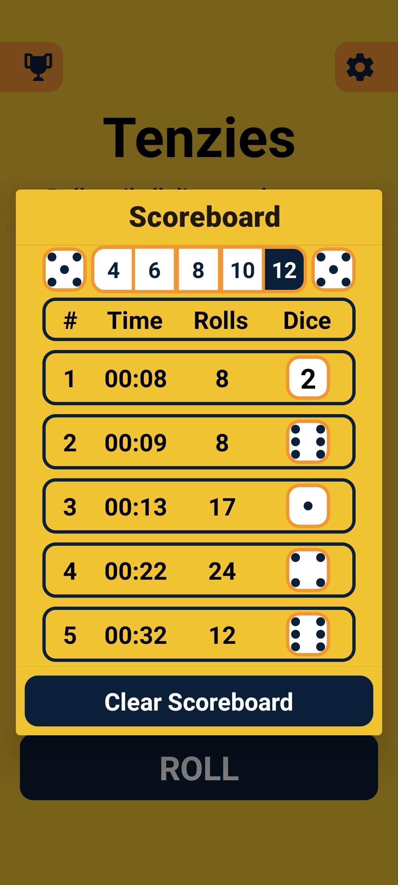

<p align="center">
    <h1 align="center">⭐ Tenzies ⭐</h1>
</p>

<p align="center">Roll until all dice are the same. Click each die to freeze it at its current value between rolls.</p>
<p align="center">Try it out on your <a href="https://yahyabagia.github.io/tenzies-expo/" target="_blank">browser 🌐 </a> &nbsp;/&nbsp;<a href="https://expo.dev/@yahyabagia/tenzies-expo" target="_blank">mobile device 📱</a>.</p>

<p align="center">
<table>
<tr>
<td></td>
<td></td>
<td></td>
<td></td>
</tr>
</table>
</p>

## Supported Platforms

| OS      | Status                                                                                         |
| ------- | ---------------------------------------------------------------------------------------------- |
| Android | Works via [Expo Go](https://docs.expo.dev/get-started/installation/#2-expo-go-app-for-ios-and) |
| iOS     | Works via [Expo Go](https://docs.expo.dev/get-started/installation/#2-expo-go-app-for-ios-and) |
| Web     | Works on the Browser (last 2 versions)                                                         |

## Environment setup

Follow the steps of the official [Expo documentation](https://docs.expo.dev/) to setup your development environment.

Quick steps:

- Install [NodeJS](https://nodejs.org/en/)
- Install [expo-cli](https://docs.expo.dev/workflow/expo-cli/) (`npm install -g expo-cli`)

## To run the app

### Clone the Repo:

```bash
git clone https://github.com/YahyaBagia/tenzies-expo.git
```

### Install the Packages:

```bash
yarn
```

### Run on Android:

```bash
yarn android
```

### Run on iOS:

```bash
yarn ios
```

### Run on Web:

```bash
yarn web
```
